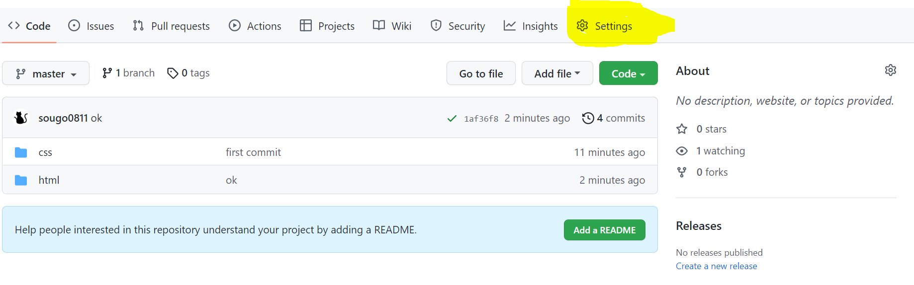
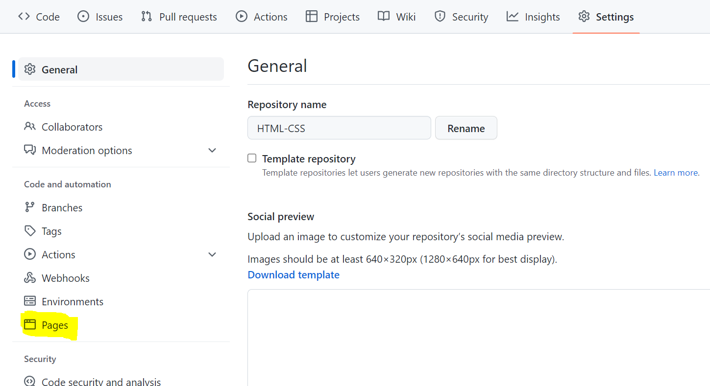
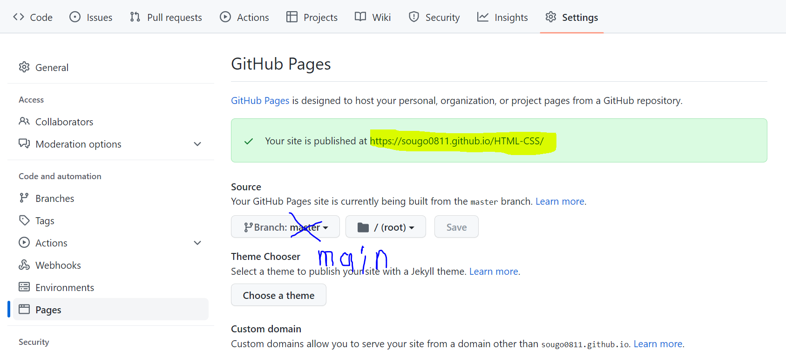

# GitHub Pagesに自己紹介サイトをデプロイしよう

(デプロイとは、開発したソフトウェアを実際の運用環境に配置・展開して実用に供することを指す) 

### <b>平たく言うと、作成した自己紹介サイトをインターネット上で見れるようにアップロードしようということ！</b>
 

## やり方
### 1. 自己紹介サイトのリポジトリのSettingsから設定画面に飛ぶ。

### 2. 設定画面のPagesからサイトを作成する画面に飛ぶ。

### 3. GitHub Pagesの画面からURLの設定(Branch:main ディレクトリ:/(root))をしてSave

### 4. 緑のところのURLをコピーして[ここ](https://docs.google.com/spreadsheets/d/1yNDufV05BMOXrV_p0zX2a3lL6KCto_cbjSbFG6M74zA/edit#gid=698392997)をクリック！

## これであなたの自己紹介サイトは世に公開されました！お疲れ様でした。