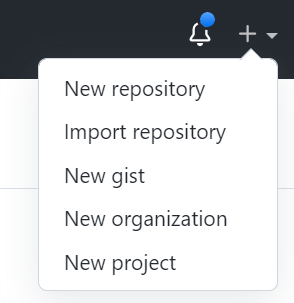
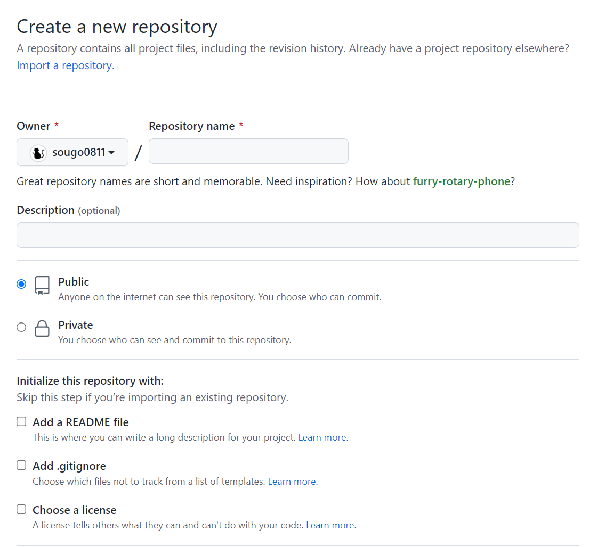

# GitのリポジトリをGitHubにあげよう

1. [SSH keyを作ろう](#ssh-keyを作ろう)

1. [GitHubでリポジトリを作成しよう](#GitHubでリポジトリを作成しよう)

1. [GitのリポジトリをGitHubにあげよう](#gitのリポジトリをgithubにあげよう)

<br>

## SSH keyを作ろう

### SSH keyってなに？
SSHとは「Secure SHell」の略で、ネットワークに接続された別のコンピューターをリモートで操作するための方法<br>
隔から、サーバーの内部を操作したり、ファイルの送受信を行ったり出来るソフトは「FTP」や「Telnet」といったものが昔からありますが、SSHでは通信データが「暗号化」されるため、これらよりも安全に遠隔操作を行うことが出来ます。<br>
<br>
このためSSHでサーバーに接続する際には「認証」を行う必要があります。<br>

### 様々な認証方式
GitHubでは、以前は3つの認証方式がありました。
1. パスワード認証方式
2. 公開鍵認証方式
3. 個人アクセストークン

#### パスワード認証方式
パスワード認証方式とは、ユーザー名とパスワードをあらかじめ決めておき、サーバーに接続する際にこれらを使ってログインする方式です。<br>
パスワード認証は一般的に馴染み深く簡単な方法なのですが、例えば、管理者が単純なパスワードを設定してしまったり、他のサイトと同じパスワードを使い回してしまったりして、万が一パスワードが知られてしまうと、不正にログインされてしまう危険性があります。<br>


#### 公開鍵認証方式
公開鍵認証方式では、2つの鍵を使って認証を行います。<br>
1つは「秘密鍵」、もう1つは「公開鍵」と呼ばれるものです。(ちなみに「鍵」と呼んでいますが、実態はコンピューター上のデータです。)<br>
秘密鍵は「電子署名」というデータを「作る」ことが出来ます。<br>
公開鍵はその署名データが正しいかどうか「検証する」ことが出来ます。<br>


##### 個人アクセストークン
パスワード認証方式のパスワードをサーバー側が発行するようなもの。<br>
詳しく知りたい方は、[このサイトへ](https://qiita.com/TakahikoKawasaki/items/e37caf50776e00e733be)<br>

### GitHubでSSH keyを作成！
注意：以降の操作はコマンドプロンプトではなくGit Bashで行います。

```
git config --global user.name "ユーザー名"
git config --global user.email "メールアドレス"
git config --global core.quotepath false #日本語ファイル名がエスケープされないように
```
上記の設定を行うと、ユーザのホームディレクトリに.gitconfigファイルが生成されます。<br>
(隠しファイルになっているので、エクスプローラーの表示の隠しファイルの横にチェックマークがついていないと見れないよ。)<br>
または以下のコマンドであるか見れるよ。
```
cd ~
ls -la | grep .gitconfig
```
#### 次に秘密鍵と公開鍵を作成<br>
ユーザのホームディレクトリに.sshディレクトリを作成します。<br>
```
mkdir ~/.ssh
cd ~/.ssh
```
そして、.sshディレクトリの中に秘密鍵と公開鍵を生成します。<br>
鍵に紐づくパスフレーズを設定しますが、あとで必要になるので忘れないようにしてください。<br>
```
ssh-keygen -t rsa -C 'メールアドレス'
#keyを作成するか聞かれるのでEnter
#パスフレーズを入力
#パスフレーズを再入力
```
#### GitHubに公開鍵を設定する
生成した公開鍵(rsa.pub)をテキストエディタで開き、中身を全てコピーします。
GitHubにアクセスし、下記の手順通りに公開鍵を登録します。

1. GitHubにログインし、右上のメニューから Settings を選択
2. SSH and GPG keys を選択
3. New SSH Keyを押下
4. Title(自由)、Key(コピーした内容をペースト)を入力して Add SSH keyを押下
以上でSSH接続の設定が完了です！


## GitHubでリポジトリを作成しよう

* New repositoryをクリック<br>


* Repository name(リポジトリの名前)とDescription(リポジトリの説明)を記入しよう<br>
* リポジトリの公開設定を決める<br>
  * Publicなら誰でも自由に閲覧＆Pull Requestを立てれる<br>
  * Privateなら自分以外は許可した人しか閲覧＆Pull Requestを立てられない<br>
(Pull Requestとは、「編集リクエスト」のような機能で、こういう修正をしてみたけど、もし良ければ反映して下さい、というものです。)<br>
* その他の設定
  * Add a README file<br>
  READMEファイルを作成するかどうか<br>
  (READMEファイルとは、主に「システムの概要」「ツールの使い方」「インストール方法」などの、リポジトリに格納されたソースコードを利用したり、参照する前に読んでほしい内容を記載するファイル。)<br>
  * Add .gitignore<br>
  .gitignoreファイルを作成するかどうか<br>
  (.gitignoreはGitの管理対象から外すためのルールを記述するファイル)<br>
  * Choose a license<br>
  リポジトリにライセンスを付与するかどうか<br>
  ([詳しくはこちら](https://docs.github.com/ja/repositories/managing-your-repositorys-settings-and-features/customizing-your-repository/licensing-a-repository))


<br>

## GitのリポジトリをGitHubにあげよう

GitHubでリポジトリを作成できたら、GitのリポジトリとGitHubのリポジトリを連携させます。
```
git remote add origin  git@github.com:ユーザーネーム/リポジトリネーム.git
```

GitのリポジトリをGitHubのリポジトリにプッシュしよう
```
git push -u origin main
```
(git pushのオプション -u とは、ローカルリポジトリの現在のブランチの上流をorigin main に規定することを意味している。<br>
<b>すなわち、次からは git push だけで上記のコマンドと同じことを実施できる。さらに、git pull だけでも git pull origin main と同じ意味になる。<b>)

[参考資料1](https://blog.senseshare.jp/ssh-public-key-authentication.html)
[参考資料2](https://qiita.com/hollyhock0518/items/a3fee20951cd92c87ed9)