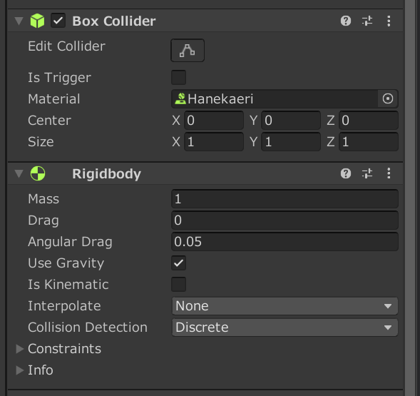

# ブロックをバウンドさせる方法

1. Cubeの作成 
Hieraruchyタブで右クリック ➡ 3D object ➡ Cube

1. CubeにBoxColliderとRigidBodyのコンポーネントを追加
写真のようにするがMaterialの部分は今はなくてよい。 

1. Assetsのタブ上で物理スクリプトを作成

写真のような設定だとほぼ一定感覚でバウンドする。

## 物理スクリプトの説明
* Dynamic Friction 動摩擦力
* Static Friction 静止摩擦力
* Bounciness 跳ね返り係数
* Friction Combine 摩擦力の範囲
* Bounciness Combine 跳ね返り係数の範囲